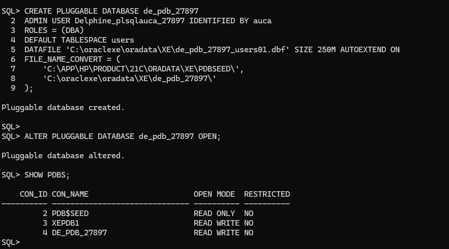

# pl-sql-assignment-2--Delphine-Uwineza

# Assignment II: Database Creation, Deletion &amp; OEM

**Names:** Uwineza Delphine
**ID:** 27897

---

# A short Report 

## Overview of Tasks

### **Task 1 – Create a New Pluggable Database (PDB)**

- Created a PDB named `de_pdb_27897`.  
- Created a dedicated admin user `Delphine_plsqlauca_27897` with password `auca`.  
- Verified creation by checking the PDB list in SQL*Plus.

**Screenshot:**

### **Task 2 – Create and Delete a PDB**

- Created a temporary PDB `de_to_delete_pdb_27897`.  
- Verified creation.  
- Deleted the temporary PDB including its datafiles.  
- Verified deletion.

**Screenshots:**

### **Task 3 – Oracle Enterprise Manager (OEM)**

- Logged into OEM dashboard.  
- Verified the PDB `de_pdb_27897` exists and is open.  
- Took screenshot showing the username clearly.

---

## Screenshots

- **PDB Creation:**

- **PDB Deletion:**

- **OEM Dashboard:**

---

## Notes

- Encountered issues with permissions during PDB creation, resolved by ensuring the correct user privileges were set.
- I encountered several connection issues such as ORA-12560, ORA-12537, and OEM port access errors.I solved them by starting all Oracle services, setting ORACLE_SID=XE, and reconfiguring the HTTPS port (5500) to restore access to SQL*Plus and the OEM dashboard.
